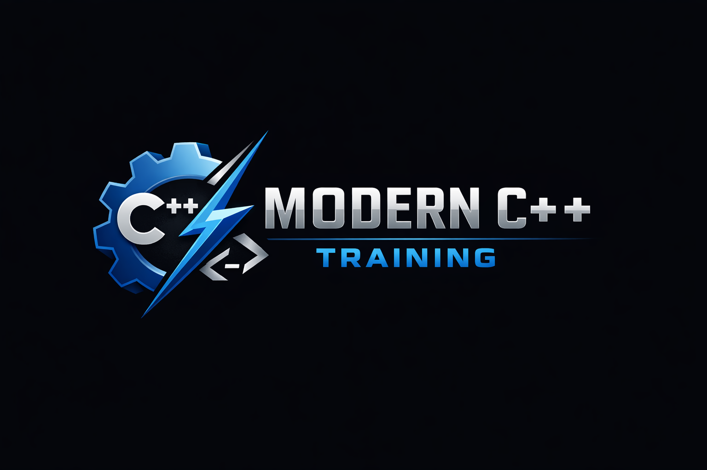

<p align="center">
  
</p>
<p align="center">
  
  
  
  
  
</p>

# **CppPlayground**

A personal learning space for exploring **modern C++** concepts through small, focused experiments.  
Each project in this solution isolates a single idea — from move semantics and RAII to templates, constexpr, and STL algorithms — making it easy to learn, test, and revisit concepts without the weight of a full application.

## 🎯 Purpose

CppPlayground exists to:

- Build intuition for modern C++ (C++17/20/23)
- Practice language fundamentals in isolation
- Experiment freely without affecting production code
- Create a reference library of small, self‑contained examples
- Track progress as new concepts are mastered

## 🗂️ Structure

The solution is organized into multiple small projects, each dedicated to one topic:

```
CppPlayground/
    MoveSemantics/
    RAII/
    Templates/
    SmartPointers/
    Constexpr/
    STLAlgorithms/
    ...
```

Each project contains:

- A minimal `main.cpp`  
- Supporting headers/sources for the concept  
- Console output to visualize behavior  
- No external dependencies unless needed for learning

## 🚀 Getting Started

Open the solution in Visual Studio and run any project independently.  
Each one is designed to compile and execute on its own, making experimentation fast and safe.

## 📚 Topics Covered (so far)

- Move semantics  
- Copy vs move behavior  
- Value categories  
- RAII patterns  
- Smart pointers  
- Templates and type deduction  
- Compile‑time programming  
- STL algorithms and iterators  

*(This list will grow as new concepts are added.)*

## 🧪 Philosophy

This repository is intentionally simple.  
The goal is not to build a product — it’s to build **fluency**.

Every experiment is:

- small  
- isolated  
- easy to understand  
- easy to modify  
- easy to throw away  

CppPlayground is a place to try things, break things, and learn by doing.
